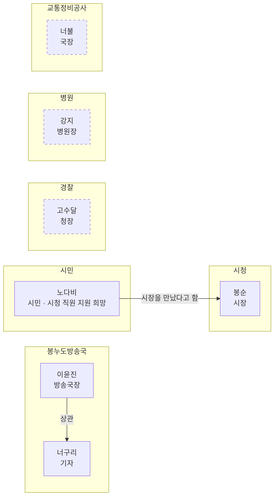

## 관계도
나희정을 뺀 인물 관계. 점선은 아직 만나지 않은 인물.

## 만난 순서
| 번호 | 인물 | 소속 | 직책 | 관계 | 첫만남 | 최근만남 |
|---|---|---|---|---|---|---|
| 001 | [[001 이윤진\|이윤진]] | [[봉누도방송국]] | 방송국장 | 동료 | 0일차 | 0일차 |
| 002 | [[002 봉순\|봉순]] | [[시청]] | 시장 | 미정 | 0일차 | 0일차 |
| 003 | [[003 너구리\|너구리]] | [[봉누도방송국]] | 기자 | 우호 | 0일차 | 0일차 |
| 004 | [[004 노다비\|노다비]] | | 시민 | 중립 | 1일차 | 1일차 |

## 관계별
- **동료**: [[001 이윤진|이윤진]]
- **우호**: [[003 너구리|너구리]]
- **중립**: [[004 노다비|노다비]]
- **미정**: [[002 봉순|봉순]]

## 아직 만나지 않은 인물
| 인물 | 소속 | 직책 | 비고 |
|---|---|---|---|
| [[고수달]] | [[경찰]] | 청장 | 임시 이름 |
| [[강지]] | [[병원]] | 병원장 | 임시 이름 |
| [[너불]] | [[교통정비공사]] | 국장 | 임시 이름 |
